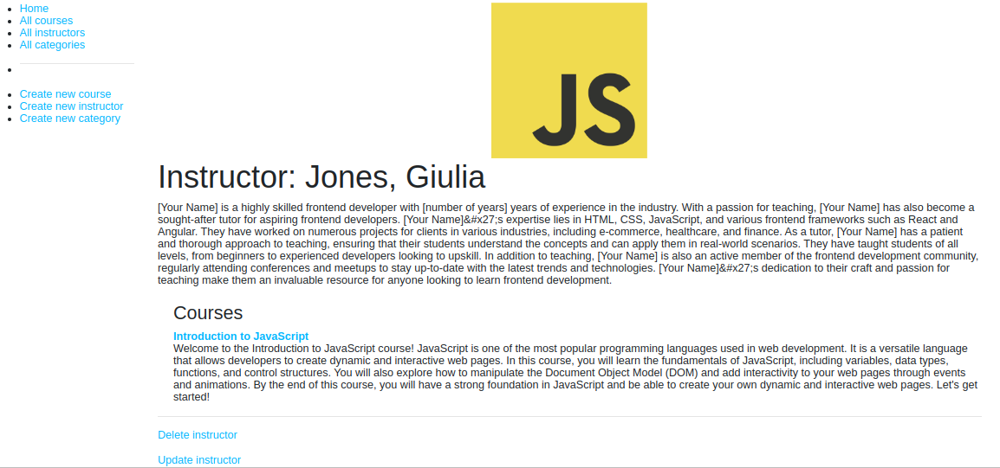

# 25.odin_inventory_app

[Task Description](https://www.theodinproject.com/lessons/nodejs-inventory-application)

[Live Preview](https://25odininventoryapp-production.up.railway.app/catalog)

This is a simple Express application that uses Mongoose to perform CRUD operations on a MongoDB database. This project is based on [MDN's local library tutorial](https://developer.mozilla.org/en-US/docs/Learn/Server-side/Express_Nodejs/Tutorial_local_library_website)

I learn:

1. how to upload images using `Multer`
2. how to limit repeated requests to APIs and endpoints using `express-rate-limit`
3. how to format Date using `luxon`

Sample:

1. 

I use the following images from bing under the license: free to share and use commercially
1. [JavaScript Logo](https://upload.wikimedia.org/wikipedia/commons/6/6a/JavaScript-logo.png)
2. [Success](https://th.bing.com/th/id/OIP.sNfb9dVRzTWl9w1hAQdMxgHaE7?pid=ImgDet&rs=1)
